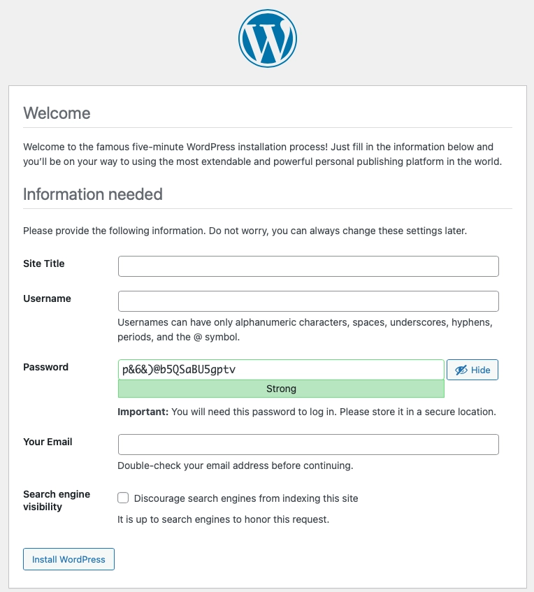

# WordPress Stack

Create a Kubernetes WordPress Stack with NGiNX, MariaDB, and WordPress ( including Composer and WP-CLI ) using Ansible and Docker.


 
## Prerequisites

1. Applications:

    - Docker Hub or Podman Desktop.
    - Docker CLI ( or Podman CLI ).
    - Visual Studio Code or equivilent code editor.
    - A Docker or Quay.io ( RedHat ) account to create repositories.
    - Minikube and kubernetes-cli.

2. Variables (defaults/main.yaml):

    - HOME: Root project folder.
    - CONFIGS: Folder location of the yaml config files.
    - MARIADB:  `[repo]/[name]:[version]` of the MariaDB image.
    - WORDPRESS:  `[repo]/[name]:[version]` of the WordPress image.
    - NGiNX:  `[repo]/[name]:[version]` of the NGiNX image.
    - DB_ROOT_PASSWORD: Mariadb Root password.
    - DB_PASSWORD: Mariadb Admin password.
    - DB_NAME: Database name.
    - DB_USER: Default database user.


3. An `.env` file with the following values:

```bash
DB_NAME=''
DB_USER=''
DB_PASSWORD=''
DB_ROOT_PASSWORD=''
DB_HOST=''
WP_ENV=''
WP_HOME='http://'
WP_SITEURL='http://wp'

# Generate your keys here: https://roots.io/salts.html
AUTH_KEY=''
SECURE_AUTH_KEY=''
LOGGED_IN_KEY=''
NONCE_KEY=''
AUTH_SALT=''
SECURE_AUTH_SALT=''
LOGGED_IN_SALT=''
NONCE_SALT=''
```
## Build

Individually, the images can be built, tagged, and pushed to a repo for easy access.

```bash
docker build -f Dockerfile -t [name] .
docker image tag [name]:latest [repo]/[name]:[version]
docker push [repo]/[name]:[version]
```

Or, using Ansible to automate the process:

```bash
ansible-playbook images.yaml -i ~/inventory.yaml
```

`images.yaml` is inside the `dockerfiles` folder

## Run

Create the deployments:

```bash
ansible-playbook deployment.yaml -i ~/inventory.yaml
```

Create the Roots/Bedrock project:

```bash
ansible-playbook bedrock.yaml -i ~/inventory.yaml
```

Navigate to the site:

```bash
minikube service nginx
```

You should see the WordPress install screen:

